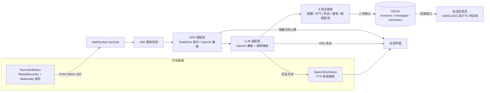
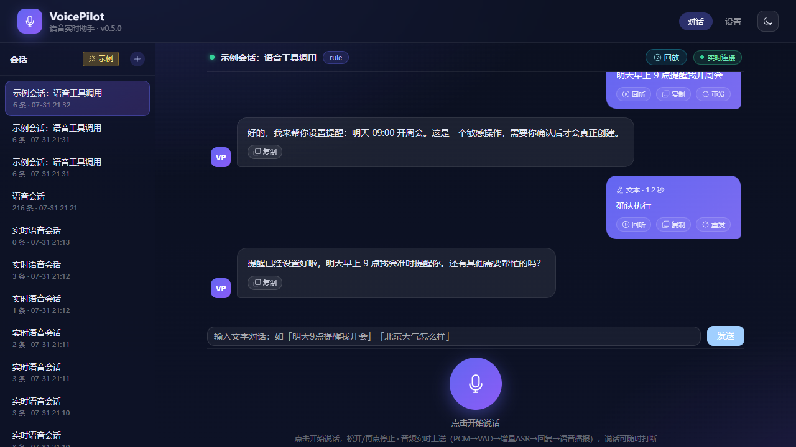
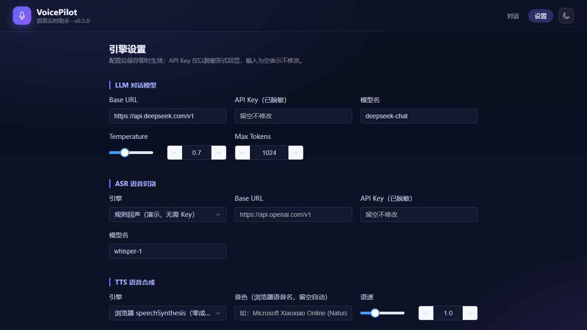
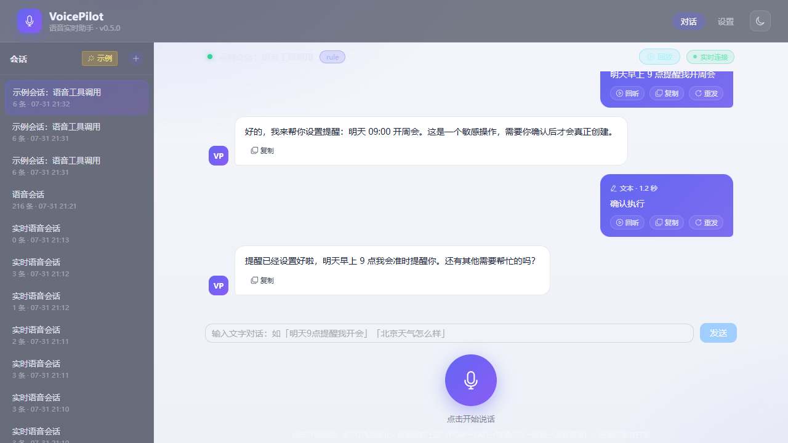

# VoicePilot · 语音实时助手


> 浏览器录音 → 流式 ASR → LLM 流式回复 → 流式 TTS 的实时语音对话闭环，支持语音触发工具调用（提醒/天气/时间/搜索）。
> 求职作品集项目（AI 应用开发工程师），与 [DocMind 多模态文档助手](https://github.com/flowerwithwind/docmind) 共同构成「视觉+文本」「音频+流式」的多模态 AI 应用叙事。

## ✨ 核心能力

| 能力 | 说明 |
|---|---|
| 🎙️ 语音采集 | MediaRecorder 录音 + WebAudio 实时波形，支持暂停/继续/取消 |
| ⚡ 实时链路 | WebSocket 双向流：PCM 分片上送 → VAD 静音检测 → 增量 ASR 上屏 → LLM 流式回复 → TTS 语音播报 |
| 🗣️ 打断（barge-in） | 说话即可打断 TTS 播报，符合真实对话习惯 |
| 🧰 语音 Agent | 意图 → 工具注册表（日程/提醒/天气/时间/搜索/数据查询 query_data），敏感操作二次确认；query_data 内置 SQLite 样例库（电商订单/库存），支持无 Key 规则降级与敏感查询二次确认 |
| 🔌 多引擎适配 | ASR：RuleEcho（无 Key 演示）→ Web Speech / OpenAI 兼容；TTS：speechSynthesis → 厂商 API |
| 🧭 可观测 | 会话回放页按 ASR / 输入 / LLM / 工具 / TTS 阶段还原完整对话时间线，语音可回听，并展示 LLM 耗时与 token（如「LLM 3.2s · ↑120 ↓480」） |
| 🚀 开箱即用 | 全程无 API Key 也能跑通（浏览器原生 ASR/TTS + 规则降级），Docker Compose 一键部署 |
| 🌐 CORS | 后端默认放行 localhost / 127.0.0.1 的 5173~5179 端口，可用 VOICEPILOT_CORS_ORIGINS 环境变量覆盖 |

## 🏗️ 架构



**技术栈**：Python 3.11 · FastAPI · SQLite · WebSocket · Vue 3 · Vite · Element Plus · WebAudio · Docker Compose · GitHub Actions

## 📸 界面预览

| 实时对话（暗色） | 会话回放时间线 |
|---|---|
|  |  |

| 设置页（引擎配置） | 亮色模式 |
|---|---|
|  |  |

## 🚀 快速开始

### 方式一：Docker Compose（推荐，一键启动）

```bash
docker compose up -d --build
# 前端 http://localhost:5174  ·  后端 API http://localhost:8010/api/health
```

> 可选：在仓库根目录创建 `.env` 覆盖引擎配置（默认 rule 演示模式，无需任何 Key）：
> ```bash
> VOICEPILOT_ASR=openai
> VOICEPILOT_ASR_BASE_URL=https://api.openai.com/v1
> VOICEPILOT_ASR_API_KEY=sk-xxx
> ```

### 方式二：本地开发

```bash
# 后端（FastAPI，端口 8010）
cd backend
python -m venv .venv && .venv\Scripts\activate      # Windows
# source .venv/bin/activate                           # macOS / Linux
pip install -r requirements.txt -r requirements-dev.txt
uvicorn app.main:app --reload --port 8010

# 前端（Vue 3 + Vite，端口 5174，已代理 /api 与 /ws 到 8010）
cd frontend
npm install
npm run dev
```

> CORS：后端默认允许 localhost / 127.0.0.1 的 5173~5179 端口直连（可用 `VOICEPILOT_CORS_ORIGINS` 覆盖）；开发时前端经 Vite proxy 同源访问，无需额外配置。

## 🎬 3 分钟面试演示脚本

1. **0:00–0:30 内置示例**：点击侧栏「示例」加载内置会话（语音→工具二次确认→完成闭环），点右上角「回放」查看 ASR / LLM / 工具 / TTS 五阶段时间线，语音消息可回听。
2. **0:30–1:30 实时语音**：点麦克风说「北京天气怎么样」——VAD 实时识别上屏 → LLM 流式回复 → 浏览器语音播报；播报中直接说话即可打断（barge-in）。
3. **1:30–2:30 工具闭环**：说「明天 9 点提醒我开会」→ 弹窗二次确认 → 确认后提醒创建成功；再说「查一下订单明细」→ 敏感查询二次确认 → 返回表格/摘要（query_data）；再到设置页演示接入 DeepSeek/OpenAI 兼容 LLM（Key 脱敏展示、连接测试）。
4. **2:30–3:00 工程亮点**：全程无 Key 可演示（规则回声 + 浏览器原生能力）；回放页展示 LLM 耗时/token 与工具调用链；Docker Compose 一键部署；GitHub Actions CI（pytest + ruff + vitest + build + docker build + compose 冒烟）全绿；SQLite 持久化 + 路径穿越防护 + 全参数化 SQL。

## ✅ 测试

- 后端 pytest **92 项**全绿（含语音全链路：录音 → ASR → LLM → TTS → 打断 → 回放 → LLM 指标 → query_data 工具链），ruff check 0 告警
- 前端 vitest **49 项**全绿，`npm run build` 成功
- CI（GitHub Actions）：pytest + ruff + vitest + build + docker build / compose 冒烟全绿

## 📚 文档

- [需求与开发文档](docs/需求开发文档.md)：功能规格、API 设计、数据模型、验收标准（M1–M6）
- [代码审查报告](docs/code-review.md)：逐文件审查结论与修复建议
- [已知问题](docs/known-issues.md)：P1/P2/P3 分级记录

## 📁 项目结构

```
voicepilot/
├─ backend/            # FastAPI：api / services（asr·llm·tts·tools·chat）/ audio（vad·pcm）/ storage（sqlite·files）
├─ frontend/           # Vue 3：views（Chat·Settings·Replay）/ components / composables（recorder·realtime·speech）/ api
├─ docs/               # 需求文档 · 代码审查 · 已知问题 · 截图
├─ docker-compose.yml  # backend + frontend(nginx 同源反代 /api、/ws)
└─ .github/workflows/  # CI：backend pytest/ruff · frontend vitest/build · docker build
```
